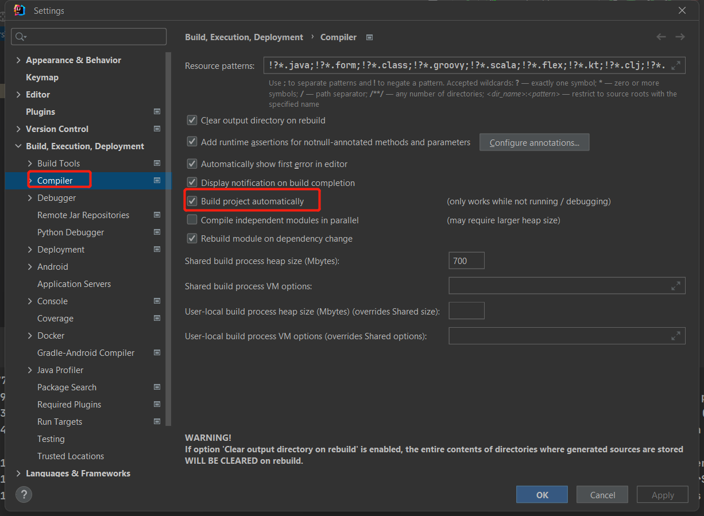
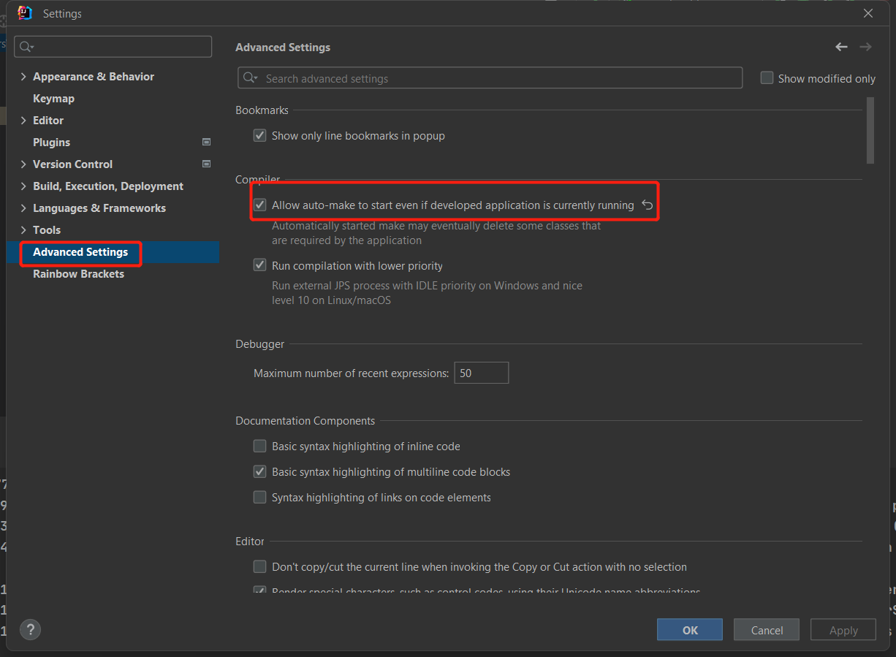

### API Path

| Methods | Urls | Actions | Error Response |
| ---------- | ------- | -------- |----------|
| POST | /design/images | get images list from dokcerhub ||
| Post | /design/users | add a new user ||
| Put | /design/users/{id} | update the information of a user ||
| POST | /design/templating | deploy user's designs to Kubernetes||
| Get | /design/users | get id and name of all users ||
| Get | /design/initialize | delete all users in database and insert three sample users(test only) ||
| Get | /design/database | show all information of users in database(test only) ||
| Get | /design/available-nodes | List all the avtive nodes in the cluster | 500: Kubernetes API fail |

### Develop tools
mongoDB install  [video tutorial](https://www.youtube.com/watch?v=Ph1Z97X6xno&t=448s)--- [mongoDB Community Server](https://www.mongodb.com/try/download/community)
minikube install [minikube](https://minikube.sigs.k8s.io/docs/start/)
postman install [postman](https://www.postman.com/downloads/)
docker install [docker](https://www.docker.com/get-started/)
`docker run -d -p 27017:27017 --name example-mongo mongo:latest`:run mongodb in localhost

### IDEA devtools

auto compile and run

### script:
#### start 3 node
`minikube start --nodes 3 -p multinode-demo`
#### Halt the cluster:
`minikube stop`
#### Delete all of the minikube clusters:
`minikube delete --all`
#### start back end
`./mvnw spring-boot:run`
#### start front end
Ready: image list. users db, projects db, drone 
