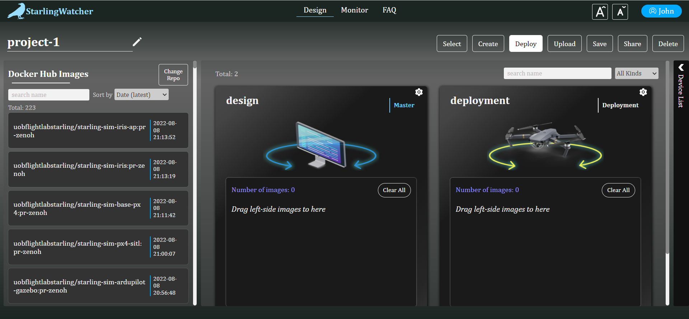
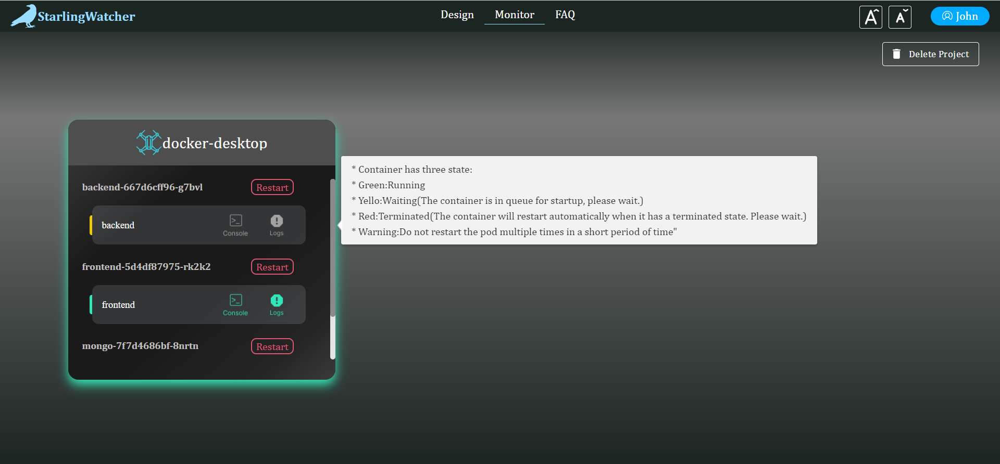

# Starling Watcher
Welcome to the Starling Watcher!
[Starling Watcher](https://github.com/ROWAN-W/SummerProject) is a kubernetes Dashboard design for [StarlingUAS](https://docs.starlinguas.dev/)!

## Features
- User Account Login.
- Deploy pods through web interaction, no need for users to write yaml files.
- Deploy pods by uploading yaml.
- Get image list based on dockerhub repository name.
- Monitor the operation of the cluster's node, pod, container, and other resources.
- Support for opening container shells and logs on the web.
- Support resize web shell and logs.
- Support restart pod and delete pod by project name.

## Example
### Design Page

### Monitor Page

## To start using Starling Watcher
1. [Installation](https://github.com/ROWAN-W/SummerProject/wiki/Installation)
- Before running the software, you need to install [docker](https://www.docker.com/) and [kubernetes](https://kubernetes.io/), Starling Watcher has been uploaded to dockerhub. users do not need to clone, just use the kubectl command to run [Aerial-Robotics-System-deploy.yaml](https://github.com/ROWAN-W/SummerProject/blob/main/Aerial-Robotics-System-deploy.yaml).
`kubectl apply -f Aerial-Robotics-System-deploy.yaml`
- To run the simulation cluster locally you can use：
    - [Kind](https://kind.sigs.k8s.io/)
    - [minikube](https://minikube.sigs.k8s.io/docs/start/)
2. [Demo](https://github.com/ROWAN-W/SummerProject/wiki/Demo)
3. [REST APIs](https://github.com/ROWAN-W/SummerProject/wiki/APIs)
4. [FAQ](https://github.com/ROWAN-W/SummerProject/wiki/FAQ)

