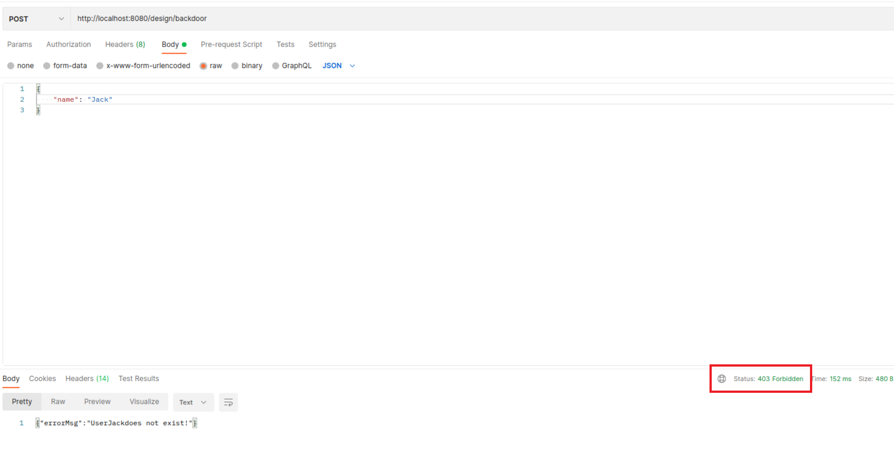
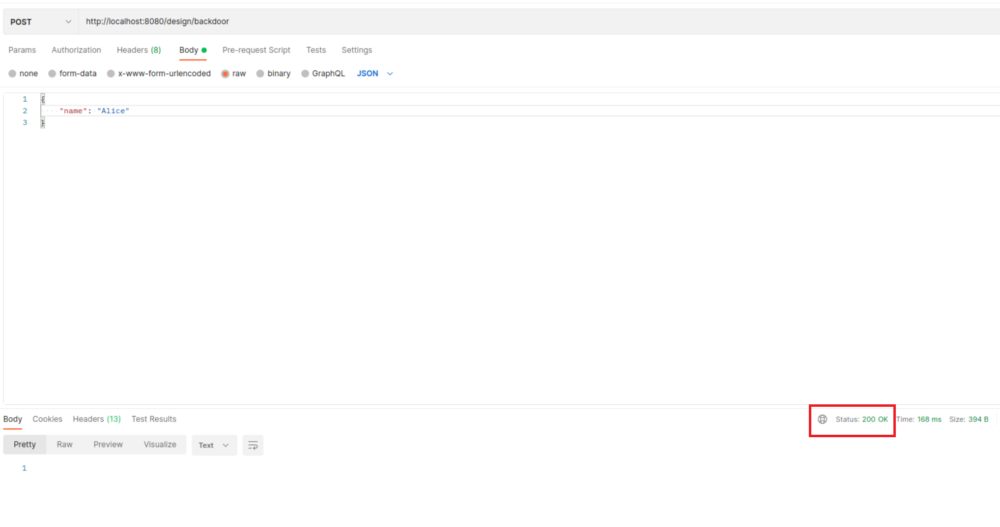

# How to change the password through back door
### Step 1: Preparation
1. Make sure Starling Watcher is running
2. Install [postman](https://www.postman.com/downloads/)
### Step 2: Add request
Open postman, create a new collection and choose "add request"

### Step 3: send request
Make a **POST** request to http://localhost:8080/design/backdoor. Set the body a **JSON** style containing the user **name**.

### Step 3: Check Response
Check the response of the request. There may be two possible results:
1. 403 FORBIDDEN
This result suggests that the user you want to change password does not exist or the request body is not a JSON style with key "name". Check the request body!

2. 200 OK
Congraduations! The user password has been successfully set to "starling"!

