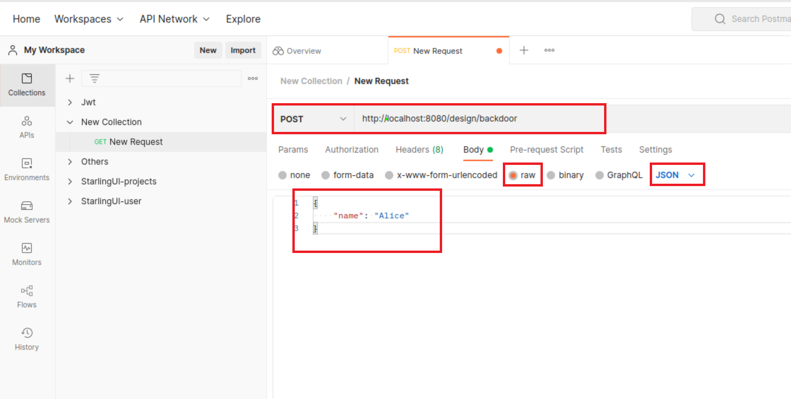

# How to change the password through back door
### Step 1: Install postman
postman can be installed [here](https://www.postman.com/downloads/)
### Step 2: Add request
Open postman, create a new collection and choose "add request"

### Step 3: send request
Make a **POST** request to http://localhost:8080/design/backdoor. Set the body a **JSON** style containing the user **name**.

### Step 3: Finished!
Now the password has been set to "starling"!
