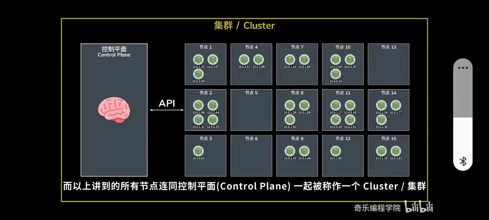
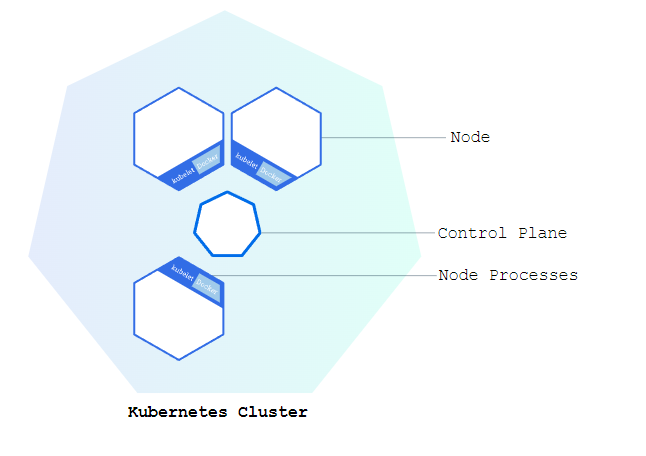
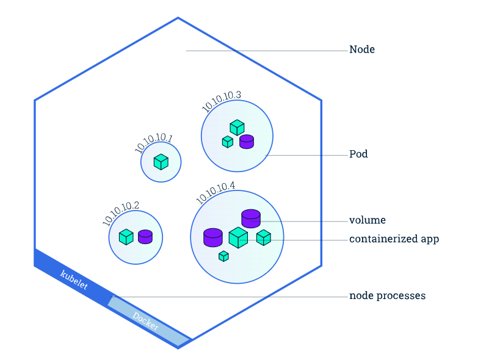
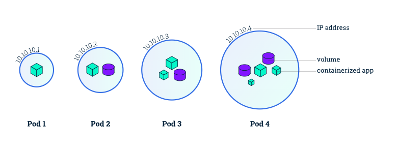
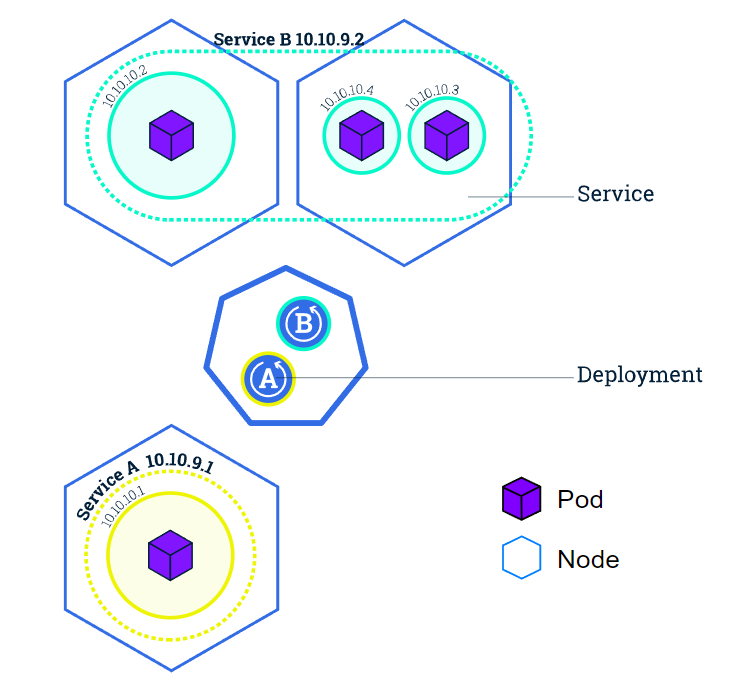
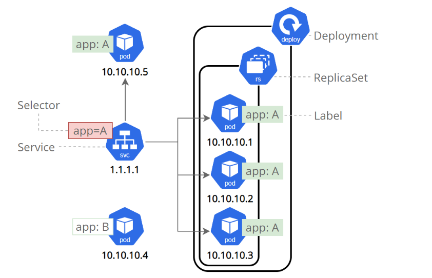
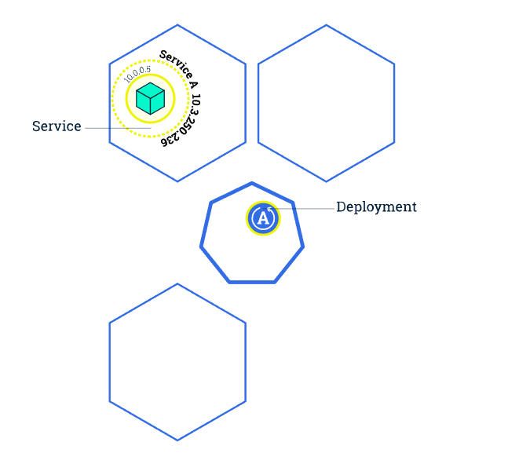
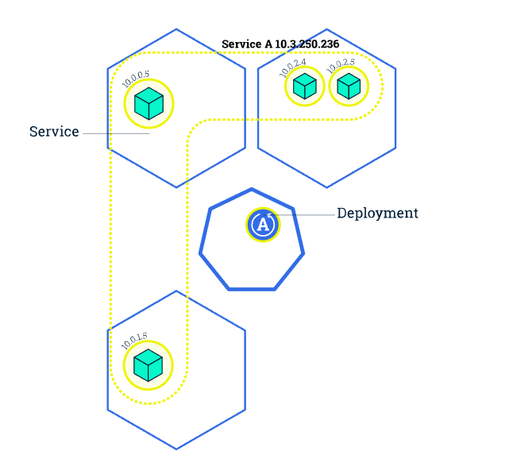

# Kubernetes Basics
A Kubernetes `cluster` consists of a set of worker machines, called `nodes`.
A `Node` consists of a set of `pods`.
A `pod` consists of a set of `containers`.
`Control Plane` talk to Node by API

A Kubernetes cluster consists of two types of resources:
  - The **Control Plane** coordinates the cluster
  - **Nodes** are the workers that run applications
**Control Plane == Master**

The **Control Plane(Master)** is responsible for **managing** the cluster.
A **node** is a **VM** or a **physical computer** that serves as a worker machine in a Kubernetes cluster.
Each node has a **Kubelet**, which is an agent for managing the **node** and communicating with the Kubernetes **control plane**.
The nodes communicate with the control plane using the **Kubernetes API**,which the control plane exposes. End users can also use the Kubernetes API directly to interact with the cluster.

### Nodes
Every Kubernetes Node runs at least:
  - Kubelet, a process responsible for communication between the Kubernetes **control plane(Master)** and the **Node**; it manages the Pods and the containers running on a machine.
  - A container runtime (like Docker) responsible for pulling the container image from a registry, unpacking the container, and running the application.

### Pods
Pods are the **smallest deployable units** of computing that you can create and manage in Kubernetes.

A Pod is a **group** of one or more **containers**, with shared storage and network resources, and a specification for how to run the containers. 

In terms of **Docker concepts**, a Pod is similar to **a group of Docker containers** with shared **namespaces** and shared **filesystem volumes**.

You can use **workload resources** to create and manage multiple Pods.
Here are some examples of workload resources that manage one or more Pods:
  - **Deployment** : Manages a replicated application on cluster.
  - **StatefulSet** : Manages deployment and scalling of a set of Pods,with durable stroage and persistent identifiers for each Pod.
  - **DaemonSet** : Ensures a copy of pod is running across a set of nodes in a cluster

### Services
A Kubernetes Service is an abstraction layer which defines a logical set of Pods and enables external traffic exposure, load balancing and service discovery for those Pods.
  - Exposing Pods to external traffic
  - Load balancing traffic across multiple Pods
  - Using labels

Although each Pod has a unique IP address, those IPs are not exposed outside the cluster without a Service.
Services can be exposed in different ways by specifying a `type` in the ServiceSpec:
  - **ClusterIP (default)** - Exposes the Service on an internal IP in the cluster. This type makes the Service only reachable from **within the cluster**.
  - **NodePort** - Exposes the Service on the same port of each selected Node in the cluster using NAT. Makes a Service accessible from outside the cluster using `<NodeIP>:<NodePort>`. **Superset of ClusterIP**.
  - **LoadBalancer** - Creates an external load balancer in the current cloud (if supported) and assigns a fixed, external IP to the Service. **Superset of NodePort**.
  - **ExternalName** - Maps the Service to the contents of the externalName field (e.g. foo.bar.example.com), by returning a CNAME record with its value. No proxying of any kind is set up. This type requires v1.7 or higher of kube-dns, or CoreDNS version 0.0.8 or higher.

###  labels and selectors
Services match a set of Pods using labels and selectors.Labels are key/value pairs attached to objects and can be used in any number of ways:
  - Designate objects for development, test, and production
  - Embed version tags
  - Classify an kubernetes object using tags

Labels can be attached to objects at creation time or later on. They can be modified at any time.
### Scaling a Deployment
The Deployment created only one Pod for running our application. When traffic increases, we will need to scale the application to keep up with user demand.
**Scaling** is accomplished by changing the number of replicas in a Deployment

### yaml

- `apiVersion` - Which version of the Kubernetes API you're using to create this object
- `kind` - What kind of object you want to create
- `metadata` - Data that helps uniquely identify the object, including a `name` string, `UID`, and optional `namespace`
- `spec` - What state you desire for the object

**The precise format of the object spec is different for** **every Kubernetes object, and contains nested fields** **specific to that object.**

**When we create yaml file : Declarative Management of** **Kubernetes Objects Using Configuration Files**